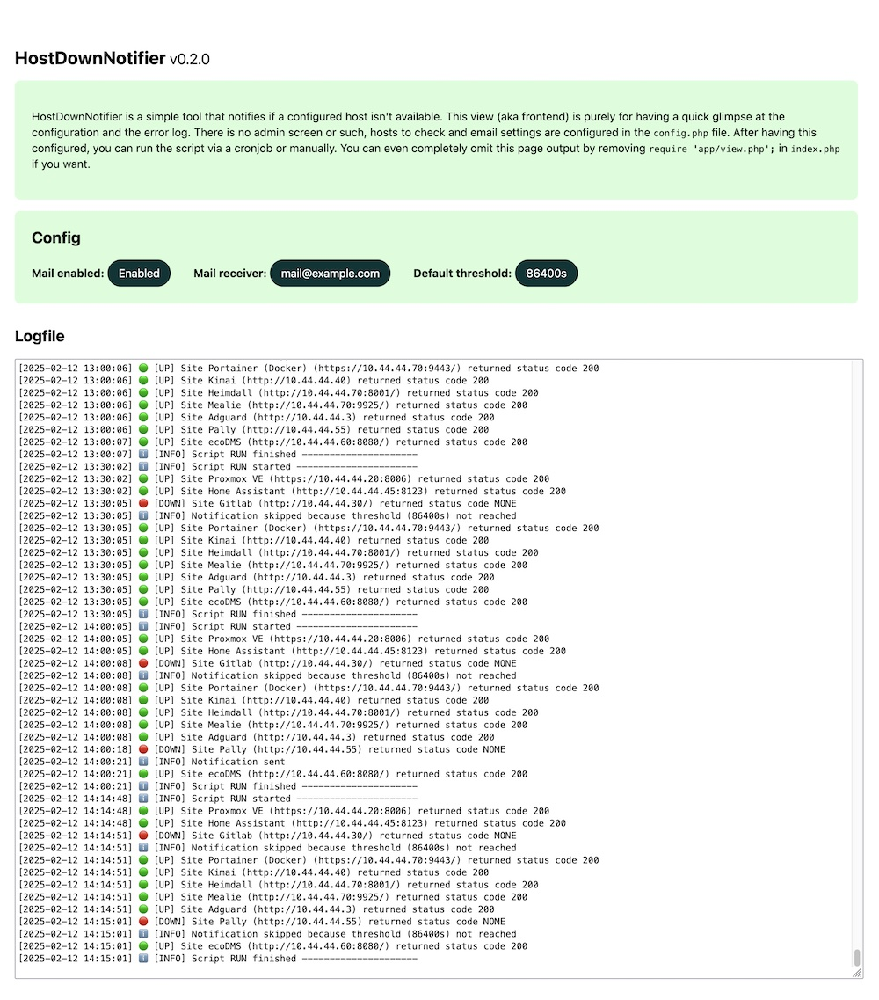

# HostDownNotifier
A simple PHP script, initially built to run on DiskStation Webstation, for monitoring HTTP hosts on the homelab network. Licensed under GNU LESSER GENERAL PUBLIC LICENSE Version 2.1 because the PHPMailer library is part of the project.

## Intention / My Usecase
I wrote this script because my Proxmox hypervisior in my homelab became a little bit wonky after moving to a new machine: From time to time guests on the Proxmox host (such as Home Assistant or Gitlab) became randomly unavailable, requiring a reboot to come back online. To investigate this issue and to see if there is a specific order the guests die, i wanted an easy way to get notified as soon as a guest does not answer HTTP requests anymore. And because my Uptime Kuma is also a guest on the wonky host, I outsourced this "monitoring" to my DiskStation (a simple 2-bay device, not capable of Docker or VMs – but able to execute PHP on WebStation and do cronjobs via the DSM Task Sheduler).

**Note:** Beside being written with DiskStation WebStation in mind, it's basic PHP wich will run on every PHP capable host – if you need to. There is no DiskStation specific stuff in there.

## Screenshot

**Note:** As the script will be called via cronjob (or DSM Task Sheduler) this frontend isn't really necessary. It is only there for doing tests (manually triggering the monitoring) and checking the configuration.

## 1. Setup on DiskStation
* Install and configure [Webstation](https://kb.synology.com/en-us/DSM/help/WebStation/application_webserv_desc)
* Install PHP 8.3 package (script was written in PHP 8.3 but may also run on slightly newer or older versions)
* Configure [Script Language Settings](https://kb.synology.com/en-us/DSM/help/WebStation/application_webserv_php)
* copy the folder `HostDownNotifier` from this repository to your WebStation Document Root
* verfiy the script could be reached by opening `http://IP-OF-YOUR-DISKSTATION/HostDownNotifier/` in your browser
(you should see an error message, prompting you to create a configuration file `config.php`)

## 2. Setup the HostDownNotifier script
* make a copy of `config.sample.php` and name it `config.php`
* adapt the email / SMTP settings in the config to match your mail server credentials
* add your `$sites` to be monitored
    * at minimum the settings `siteName` and `siteAddress` are needed
    * optionally, you can specify `notifyThreshold` ((int) minimum seconds until a new host down notification) and `acceptedStatusCodes` ((array) HTTP status codes)
    * you will find examples in the even copied sample config file
* check if the script is working by opening `http://IP-OF-YOUR-DISKSTATION/HostDownNotifier/` in your browser
    * now you should see some basic information and the log with the last monitoring results, similar to the screenshot above

## 3. Setup DSM Task Sheduler
* Open [Task Sheduler](https://kb.synology.com/en-uk/DSM/help/DSM/AdminCenter/system_taskscheduler) in DSM
* Create new scheduled task of type **Custom Script**
    * give it a name (such as `HostDownNotifier`) and assign a user who is allowed to excute `curl` on the DiskStation (propably an admin account)
    * set your time shedule, such as every 30 minutes
    * Use this as custom script command: `curl http://IP-OF-YOUR-DISKSTATION/HostDownNotifier/`

From now on, everytime the script is called by URL in the browser or via the DSM Task Sheduler `curl`, the script will check the HTTP response codes of each configured host (in `$sites`, inside `config.php`) and send a mail to the configured adress if a host is down (or became availabe again, after a downtime and the configured `notifyThreshold`).

